# Latihan Kuis 1 Jaringan Komputer

Dokumen ini disusun dari 30 foto soal di folder `Practice-Images`. Kerjakan pertanyaan pada gambar terlebih dahulu, lalu buka bagian **Jawaban dan penjelasan** untuk memeriksa hasilnya.

> Catatan: soal 17–18, 20–24, dan 25–27 memuat tiga pasang soal yang sama dengan urutan pilihan berbeda. Semuanya tetap dicantumkan agar setiap foto memiliki referensi.

## 1. Header pada transport layer

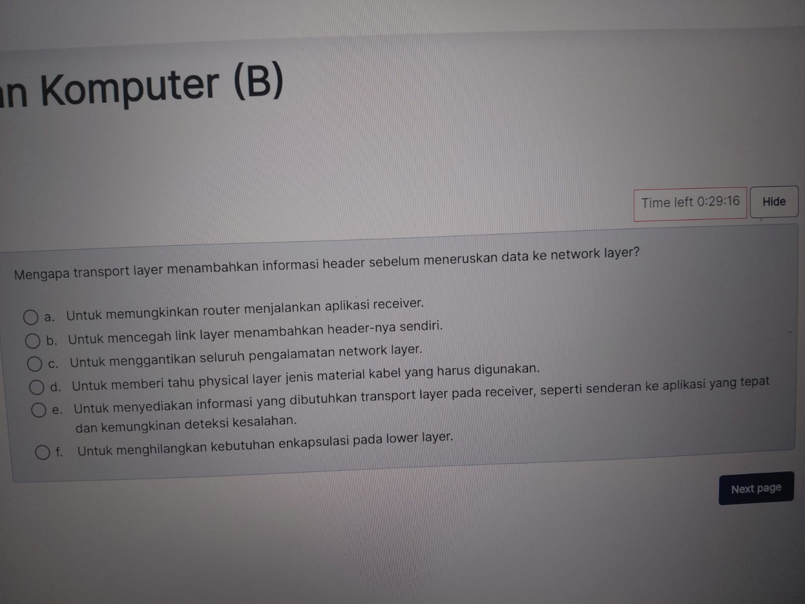

Mengapa transport layer menambahkan header sebelum meneruskan data ke network layer?

<strong>Jawaban dan penjelasan</strong>

**Jawaban: e.** Header transport membawa informasi yang dibutuhkan penerima, terutama nomor port untuk mengarahkan data ke proses/aplikasi yang tepat. Pada TCP, header juga dapat mendukung penomoran urut, acknowledgment, kontrol aliran, dan deteksi kesalahan melalui checksum.

## 2. Instantaneous throughput dan average throughput

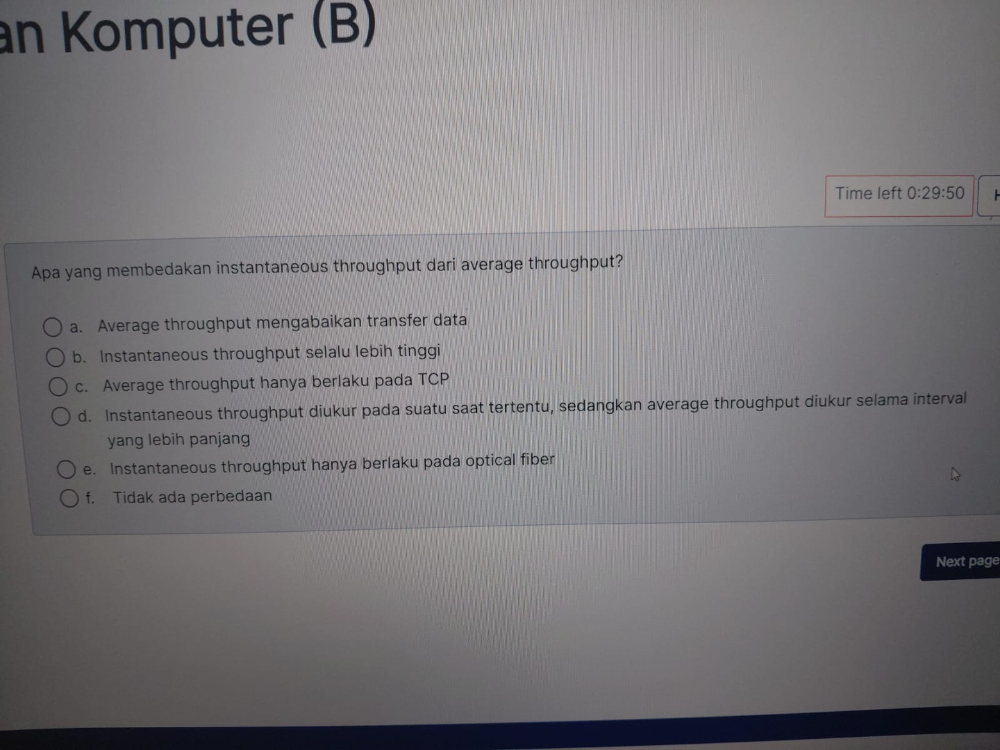

Apa yang membedakan *instantaneous throughput* dari *average throughput*?

<strong>Jawaban dan penjelasan</strong>

**Jawaban: d.** *Instantaneous throughput* adalah laju transfer pada suatu saat atau interval yang sangat pendek, sedangkan *average throughput* adalah rata-rata laju transfer selama interval yang lebih panjang.

## 3. Kebutuhan layanan Internet telephony

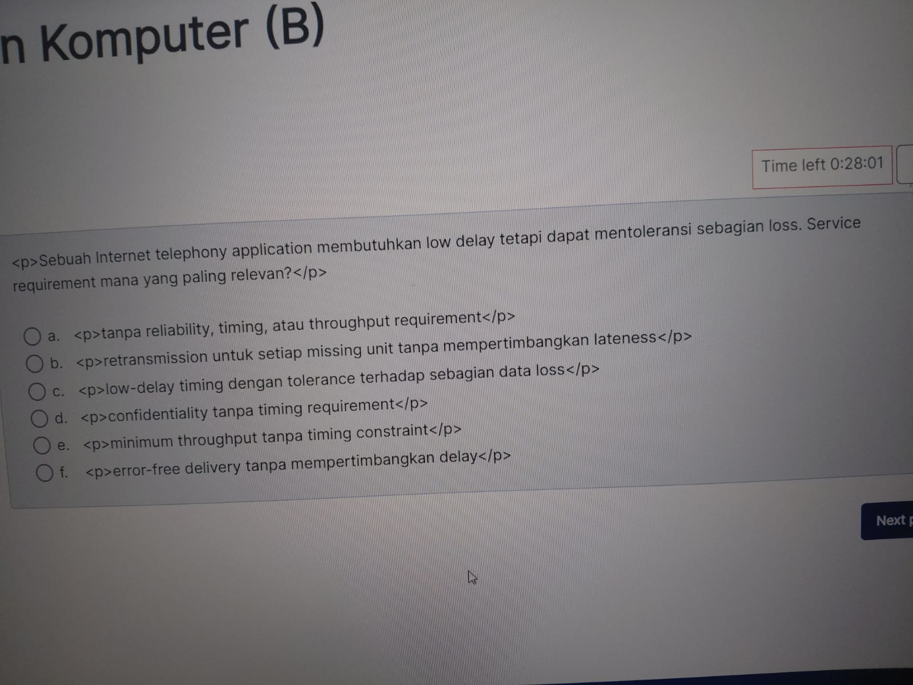

Layanan apa yang paling sesuai untuk aplikasi telepon Internet yang membutuhkan delay rendah tetapi masih dapat mentoleransi sebagian *loss*?

<strong>Jawaban dan penjelasan</strong>

**Jawaban: c.** Komunikasi suara interaktif lebih mengutamakan ketepatan waktu dan delay rendah. Sebagian kecil paket yang hilang sering lebih dapat ditoleransi daripada retransmisi yang datang terlambat dan mengganggu percakapan.

## 4. Urutan PDU saat enkapsulasi

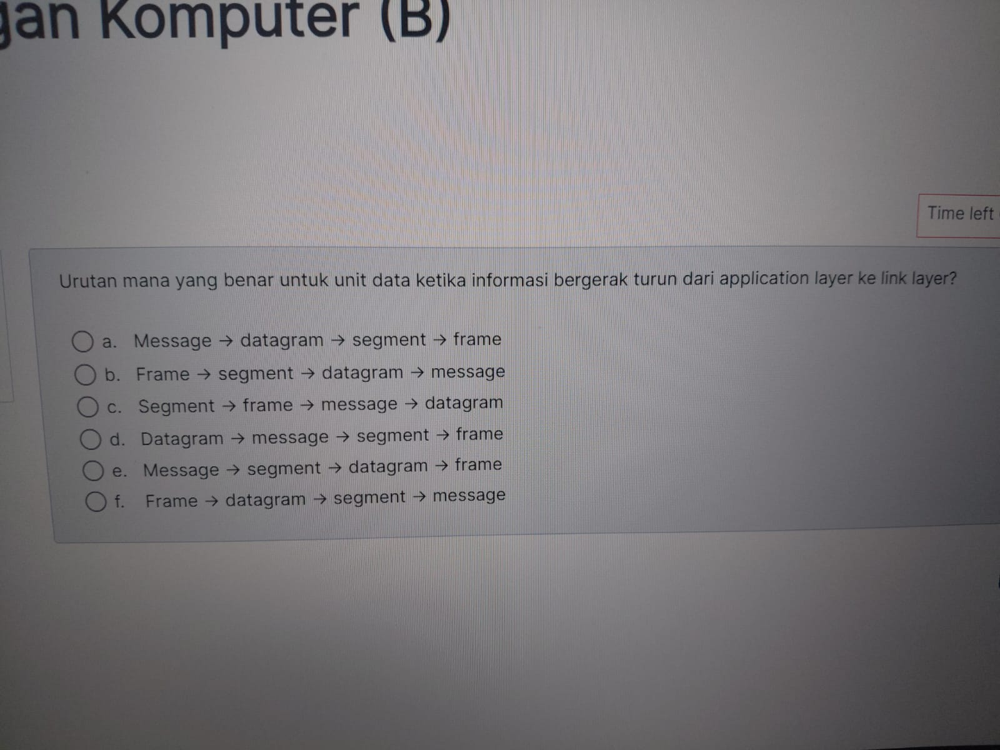

Apa urutan nama unit data ketika informasi bergerak turun dari application layer ke link layer?

<strong>Jawaban dan penjelasan</strong>

**Jawaban: e.** Urutannya adalah *message* → *segment* → *datagram* → *frame*. Application layer menghasilkan *message*. Transport layer membungkusnya sebagai *segment*, network layer sebagai *datagram*, dan link layer sebagai *frame*.

## 5. Layer pada host, router, dan switch

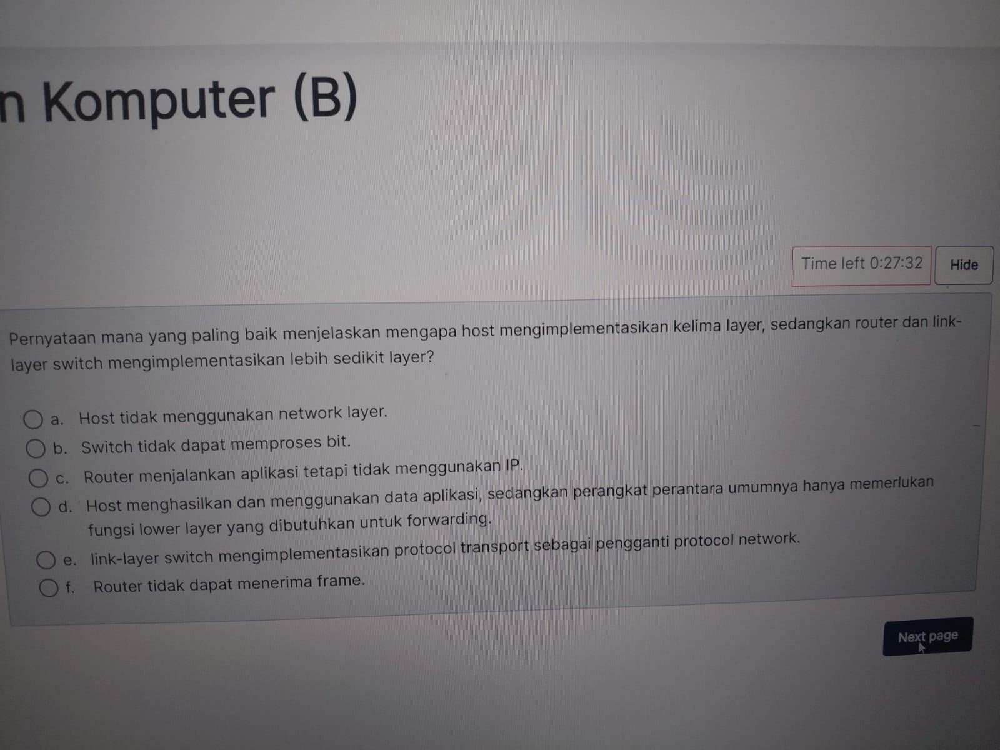

Mengapa host mengimplementasikan kelima layer, sedangkan router dan link-layer switch mengimplementasikan lebih sedikit layer?

<strong>Jawaban dan penjelasan</strong>

**Jawaban: d.** Host menghasilkan dan memakai data aplikasi sehingga membutuhkan seluruh stack. Perangkat perantara umumnya hanya memproses layer yang diperlukan untuk meneruskan data: router sampai network layer, sedangkan switch terutama link dan physical layer.

## 6. Distribusi file berbasis chunk

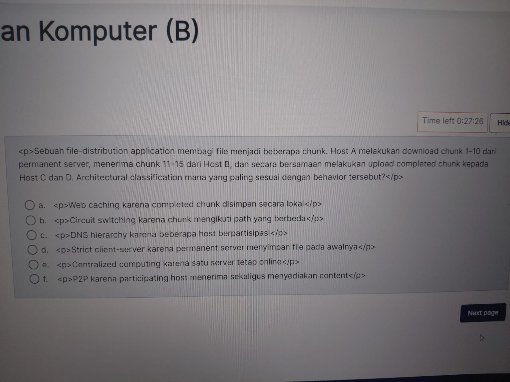

Host A mengunduh chunk dari server dan host lain, lalu mengunggah chunk yang telah dimiliki kepada host lain. Arsitektur apa yang paling tepat?

<strong>Jawaban dan penjelasan</strong>

**Jawaban: f, yaitu P2P.** Pada arsitektur *peer-to-peer*, host peserta dapat bertindak sebagai penerima sekaligus penyedia konten. Keberadaan server awal tidak membuat sistem tersebut menjadi *strict client-server*.

## 7. P2P file sharing

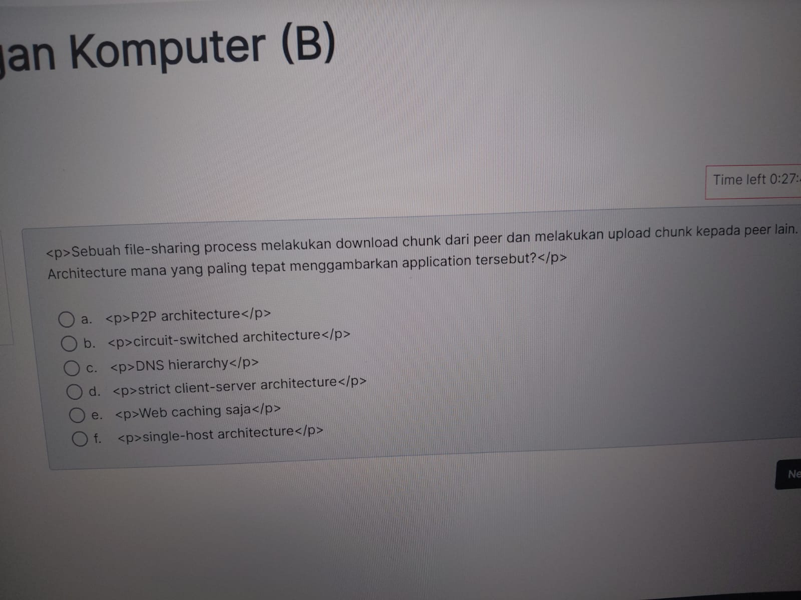

Aplikasi mengunduh chunk dari suatu peer dan mengunggah chunk kepada peer lain. Arsitektur apa yang digambarkan?

<strong>Jawaban dan penjelasan</strong>

**Jawaban: a, yaitu P2P architecture.** Setiap peer dapat meminta sekaligus menyediakan data; tidak seluruh pertukaran harus melalui satu server pusat.

## 8. Apa yang ditentukan oleh protokol?

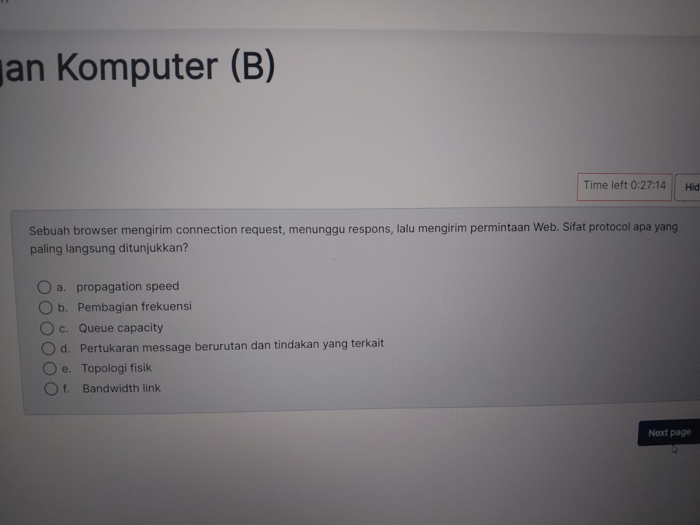

Browser mengirim *connection request*, menunggu respons, lalu mengirim permintaan Web. Sifat protokol apa yang ditunjukkan?

<strong>Jawaban dan penjelasan</strong>

**Jawaban: d.** Protokol menentukan format dan urutan pesan yang dipertukarkan, serta tindakan yang dilakukan ketika suatu pesan dikirim atau diterima.

## 9. Kompatibilitas protokol

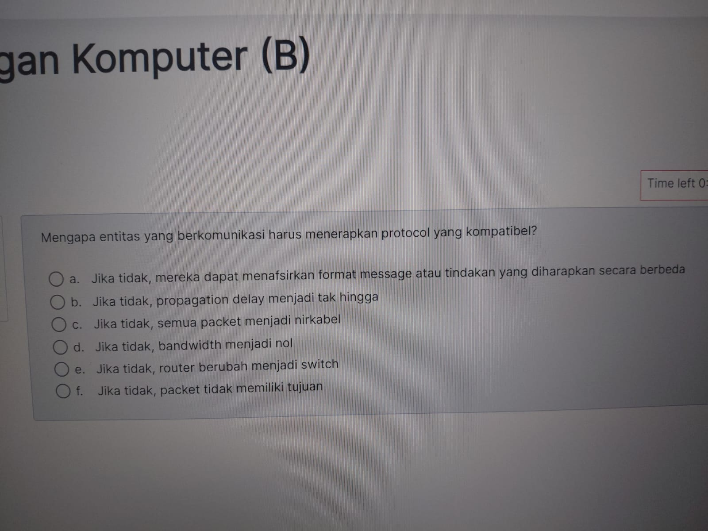

Mengapa dua entitas yang berkomunikasi harus menerapkan protokol yang kompatibel?

<strong>Jawaban dan penjelasan</strong>

**Jawaban: a.** Tanpa aturan yang sama, kedua pihak dapat menafsirkan format pesan, urutan pesan, dan tindakan yang diharapkan secara berbeda sehingga komunikasi gagal.

## 10. Perbedaan nama PDU antarlayer

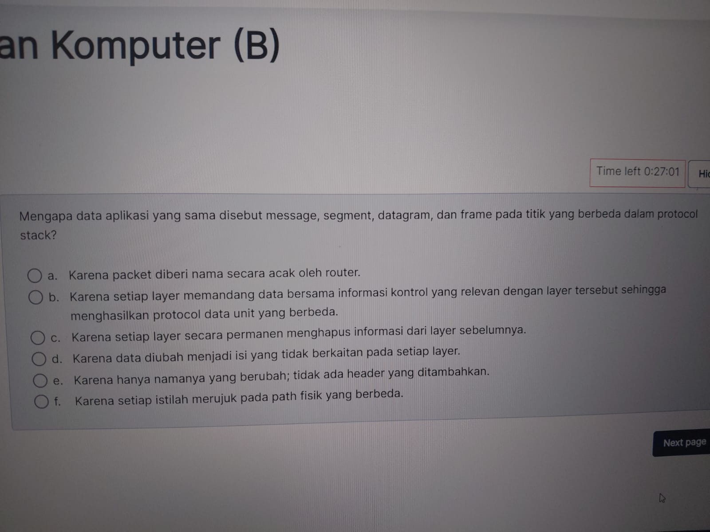

Mengapa data yang sama disebut *message*, *segment*, *datagram*, dan *frame* pada titik yang berbeda di protocol stack?

<strong>Jawaban dan penjelasan</strong>

**Jawaban: b.** Setiap layer melihat data beserta informasi kontrol yang relevan bagi layer tersebut. Penambahan header pada proses enkapsulasi menghasilkan PDU yang berbeda pada setiap layer.

## 11. Queueing delay

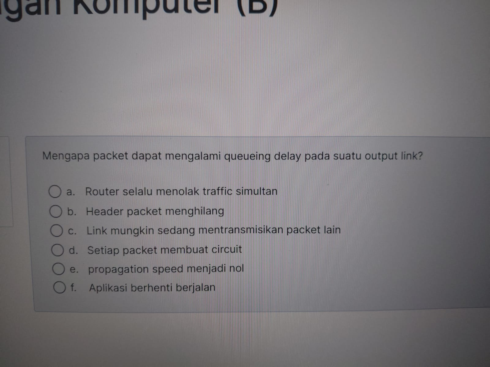

Mengapa sebuah paket dapat mengalami *queueing delay* pada suatu output link?

<strong>Jawaban dan penjelasan</strong>

**Jawaban: c.** Jika output link sedang mentransmisikan paket lain, paket yang baru tiba harus menunggu di buffer. Delay ini berubah-ubah mengikuti pola kedatangan trafik dan tingkat kesibukan link.

## 12. Keuntungan circuit switching

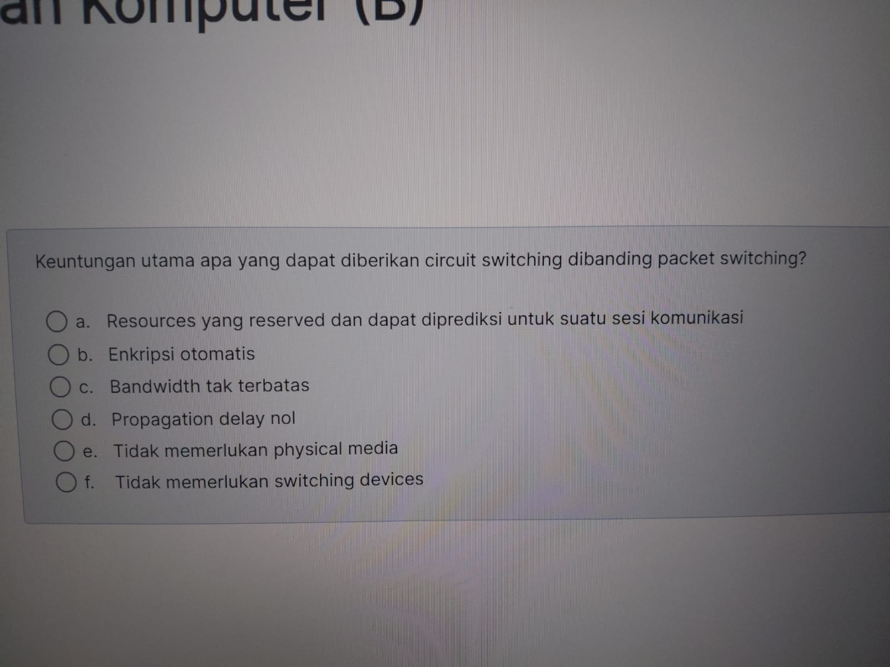

Apa keuntungan utama *circuit switching* dibandingkan *packet switching*?

<strong>Jawaban dan penjelasan</strong>

**Jawaban: a.** Sumber daya dicadangkan untuk satu sesi sehingga kapasitas dan performanya lebih dapat diprediksi. Konsekuensinya, sumber daya yang sedang tidak dipakai oleh sesi tersebut tidak mudah dimanfaatkan pengguna lain.

## 13. Peran Web pada 1990-an

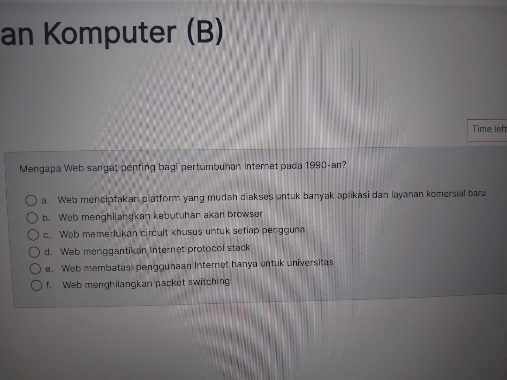

Mengapa Web penting bagi pertumbuhan Internet pada 1990-an?

<strong>Jawaban dan penjelasan</strong>

**Jawaban: a.** Web menyediakan antarmuka dan platform yang mudah diakses untuk informasi, aplikasi, dan layanan komersial sehingga Internet menarik bagi masyarakat luas, bukan hanya komunitas riset.

## 14. Transmission delay dan propagation delay

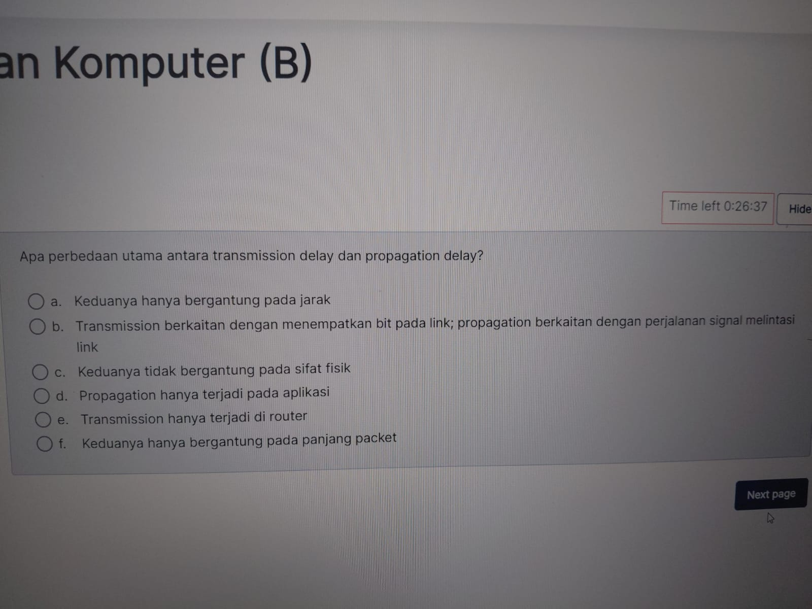

Apa perbedaan utama *transmission delay* dan *propagation delay*?

<strong>Jawaban dan penjelasan</strong>

**Jawaban: b.** *Transmission delay* adalah waktu untuk memasukkan seluruh bit paket ke link, yaitu `L/R`. *Propagation delay* adalah waktu perjalanan sinyal melintasi link, yaitu `d/s`.

## 15. Propagasi radio

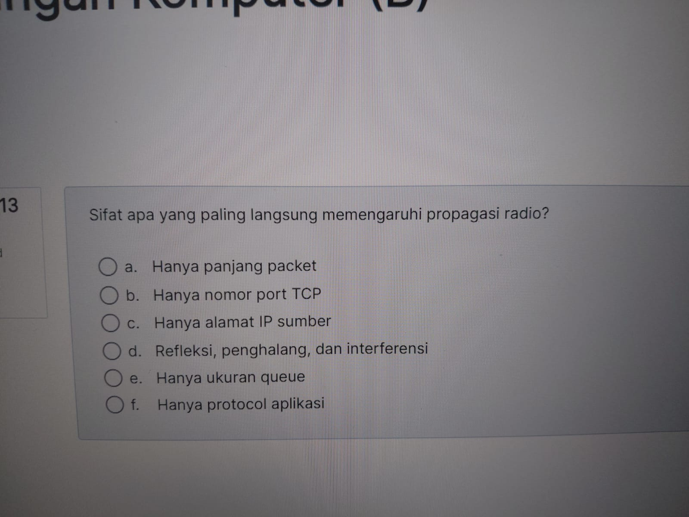

Sifat apa yang paling langsung memengaruhi propagasi radio?

<strong>Jawaban dan penjelasan</strong>

**Jawaban: d.** Refleksi, penghalang, dan interferensi memengaruhi kekuatan dan kualitas sinyal radio. Dampaknya dapat berupa pelemahan, multipath, dan error transmisi.

## 16. Cable Internet sebagai shared access network

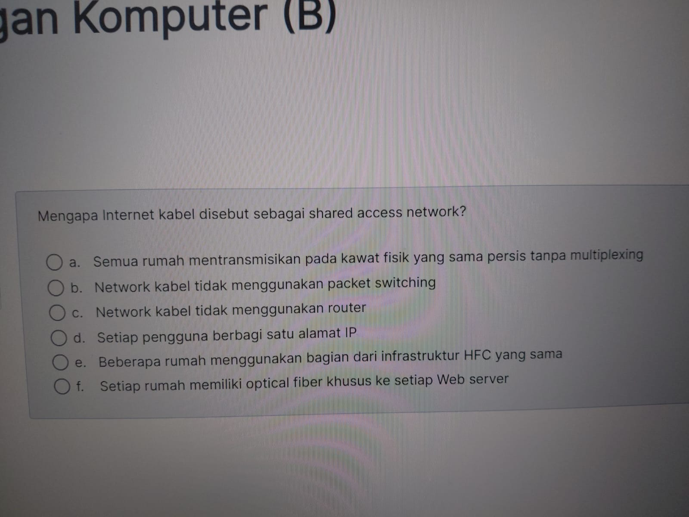

Mengapa Internet kabel disebut sebagai *shared access network*?

<strong>Jawaban dan penjelasan</strong>

**Jawaban: e.** Beberapa rumah menggunakan bagian infrastruktur HFC (*hybrid fiber-coaxial*) yang sama. Karena kapasitas segmen dibagi, trafik pelanggan lain dapat memengaruhi throughput yang dirasakan.

## 17. FTP control bersifat out-of-band (varian A)

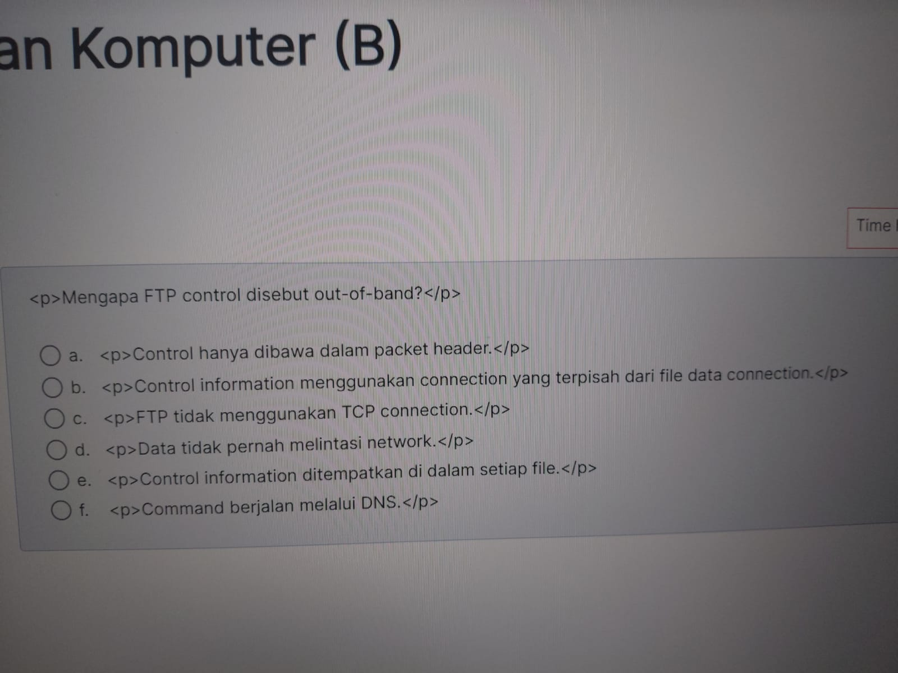

Mengapa kontrol FTP disebut *out-of-band*?

<strong>Jawaban dan penjelasan</strong>

**Jawaban: b.** Perintah dan respons kontrol menggunakan koneksi yang terpisah dari koneksi data untuk pemindahan file atau directory listing. Pemisahan dua koneksi inilah yang disebut *out-of-band control*.

## 18. FTP control bersifat out-of-band (varian B)

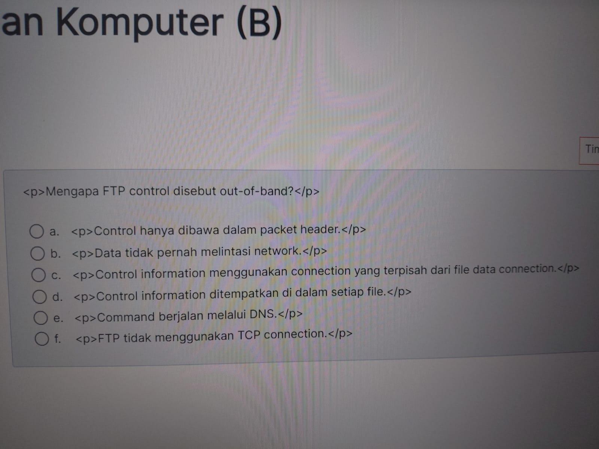

Soal ini sama dengan nomor 17, tetapi urutan pilihannya berbeda.

<strong>Jawaban dan penjelasan</strong>

**Jawaban: c.** Informasi kontrol FTP menggunakan koneksi yang terpisah dari koneksi data. Jawabannya berbeda huruf dari nomor 17 hanya karena urutan pilihan diacak.

## 19. Definisi throughput

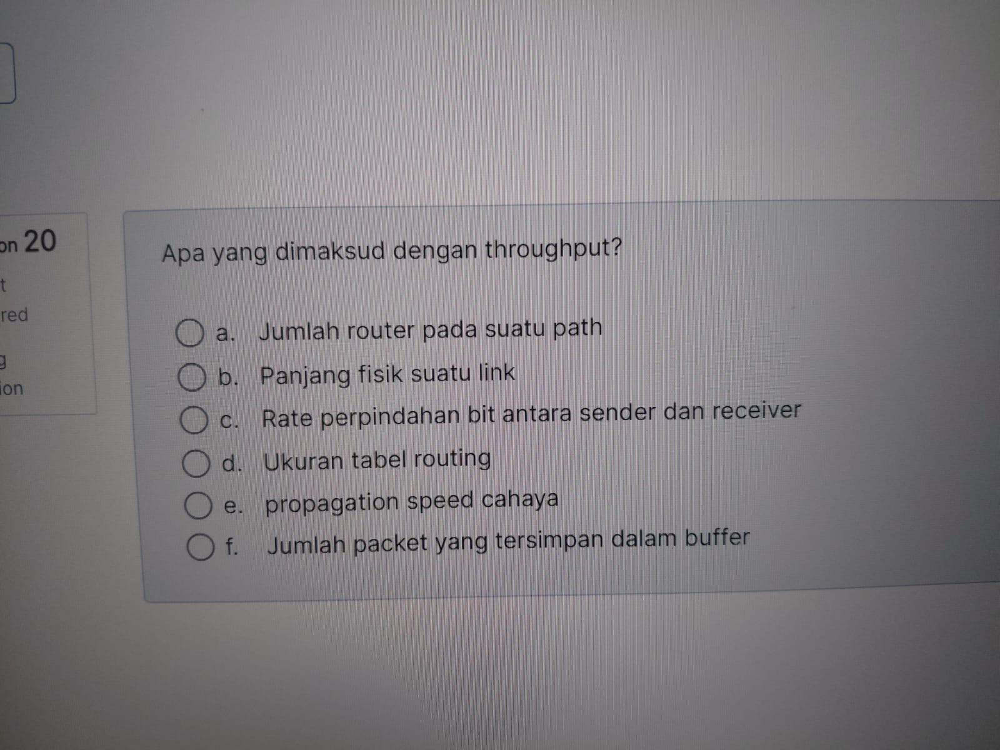

Apa yang dimaksud dengan *throughput*?

<strong>Jawaban dan penjelasan</strong>

**Jawaban: c.** Throughput adalah laju aktual perpindahan bit antara pengirim dan penerima, biasanya dinyatakan dalam bit per detik. Nilainya dapat lebih kecil daripada kapasitas nominal link akibat bottleneck, trafik bersama, dan overhead.

## 20. FTP LIST dan data connection (varian A)

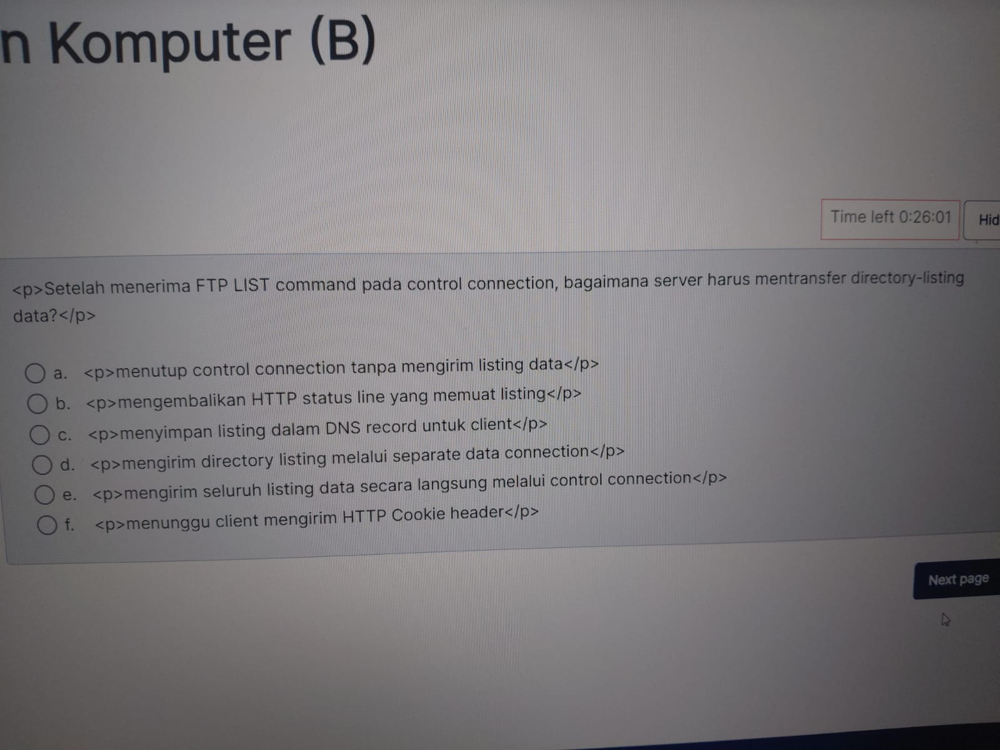

Setelah menerima perintah FTP `LIST` pada control connection, melalui koneksi mana server mengirim directory listing?

<strong>Jawaban dan penjelasan</strong>

**Jawaban: d.** Directory listing dikirim melalui koneksi data yang terpisah, bukan sebagai isi langsung pada control connection.

## 21. Enkapsulasi segment menjadi datagram

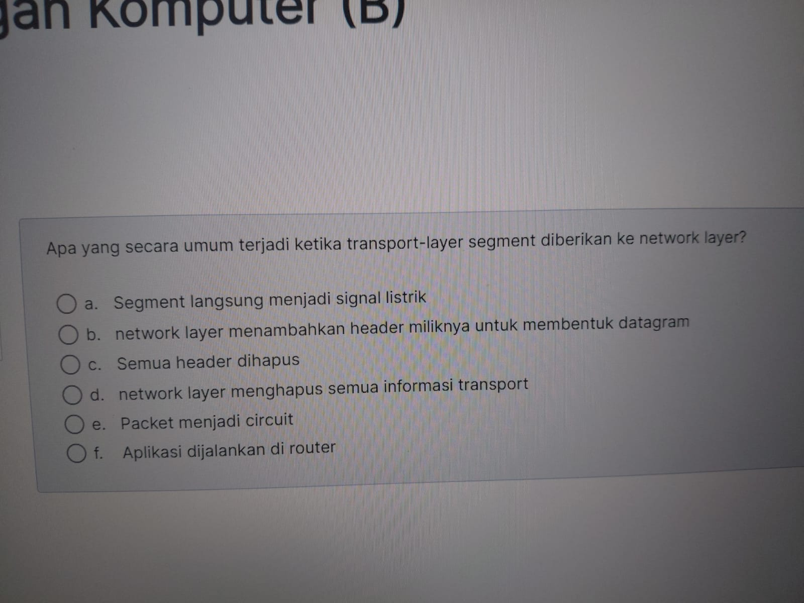

Apa yang umumnya terjadi ketika transport-layer segment diberikan kepada network layer?

<strong>Jawaban dan penjelasan</strong>

**Jawaban: b.** Network layer menambahkan header miliknya, termasuk informasi pengalamatan dan kontrol IP, sehingga terbentuk network-layer datagram.

## 22. Beberapa nilai delay pada traceroute

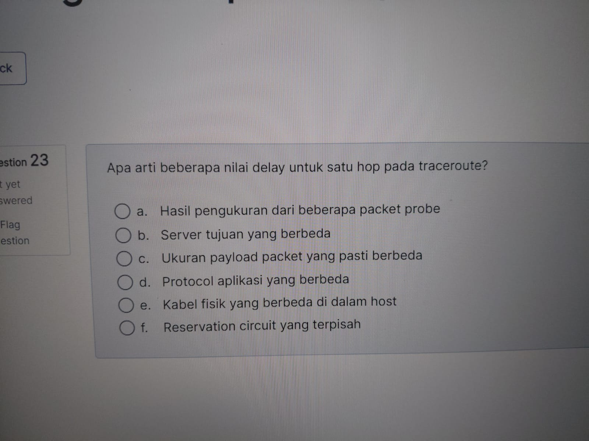

Apa arti beberapa nilai delay yang ditampilkan untuk satu hop pada `traceroute`?

<strong>Jawaban dan penjelasan</strong>

**Jawaban: a.** Nilai tersebut merupakan hasil pengukuran *round-trip time* dari beberapa paket probe ke hop yang sama. Perbedaan nilainya menunjukkan variasi delay jaringan.

## 23. Virus dan worm

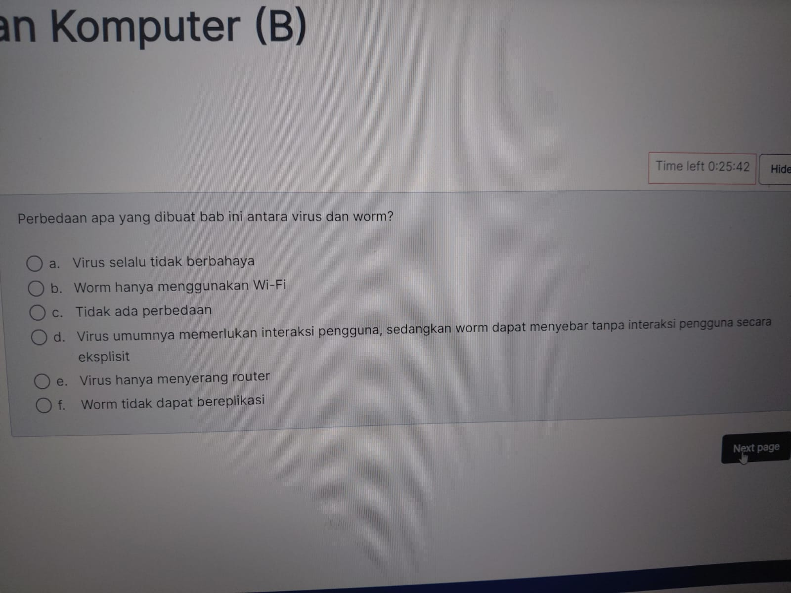

Apa perbedaan utama antara virus dan worm?

<strong>Jawaban dan penjelasan</strong>

**Jawaban: d.** Virus umumnya melekat pada file/program dan sering memerlukan tindakan pengguna untuk aktif atau menyebar. Worm dapat mereplikasi dan menyebar melalui jaringan tanpa interaksi pengguna secara eksplisit.

## 24. FTP LIST dan data connection (varian B)

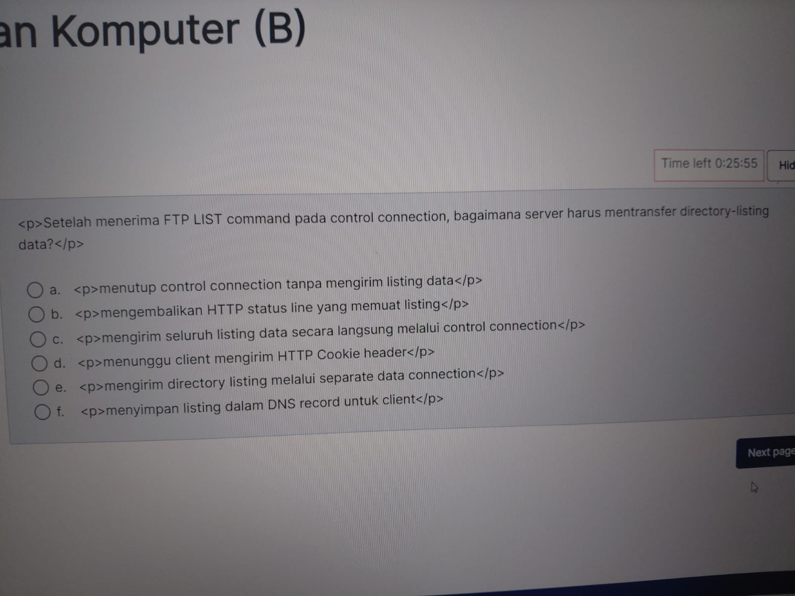

Soal ini sama dengan nomor 20, tetapi urutan pilihannya berbeda.

<strong>Jawaban dan penjelasan</strong>

**Jawaban: e.** Server mengirim directory listing melalui koneksi data terpisah. Huruf jawabannya berbeda dari nomor 20 karena pilihan telah diacak.

## 25. Elastic application (varian A)

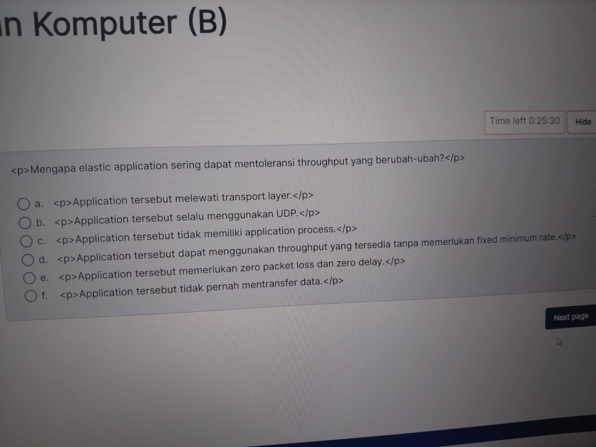

Mengapa *elastic application* dapat mentoleransi throughput yang berubah-ubah?

<strong>Jawaban dan penjelasan</strong>

**Jawaban: d.** Aplikasi elastis dapat memanfaatkan throughput yang tersedia dan biasanya tidak membutuhkan laju minimum yang tetap. Throughput yang lebih rendah terutama membuat penyelesaian transfer lebih lama.

## 26. Switch dan application-layer message

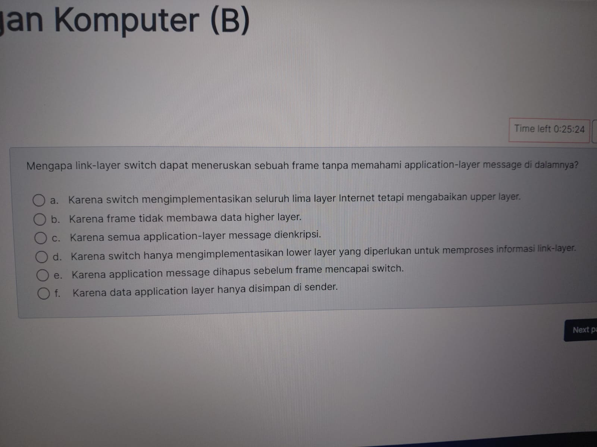

Mengapa link-layer switch dapat meneruskan frame tanpa memahami application-layer message di dalamnya?

<strong>Jawaban dan penjelasan</strong>

**Jawaban: d.** Switch memproses informasi link layer yang diperlukan untuk forwarding, misalnya alamat MAC. Payload dari layer lebih tinggi dibawa di dalam frame tanpa harus ditafsirkan oleh switch.

## 27. Elastic application (varian B)

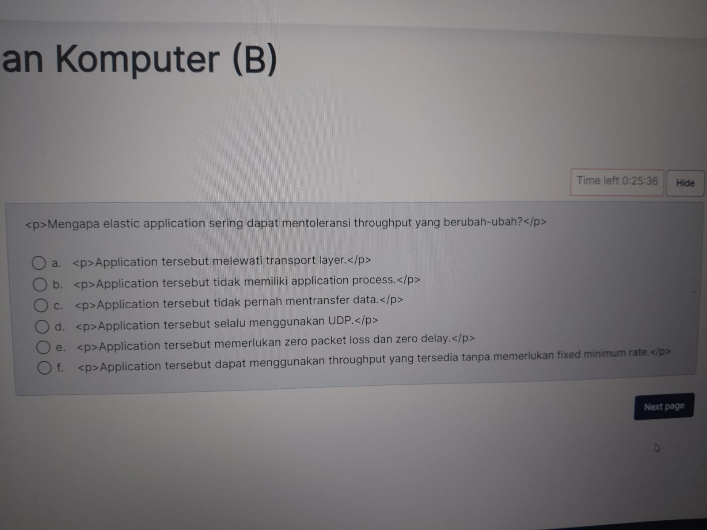

Soal ini sama dengan nomor 25, tetapi urutan pilihannya berbeda.

<strong>Jawaban dan penjelasan</strong>

**Jawaban: f.** Aplikasi dapat memakai throughput yang tersedia tanpa membutuhkan *fixed minimum rate*. Huruf jawabannya berbeda dari nomor 25 karena urutan pilihan diacak.

## 28. Interkoneksi antar-ISP

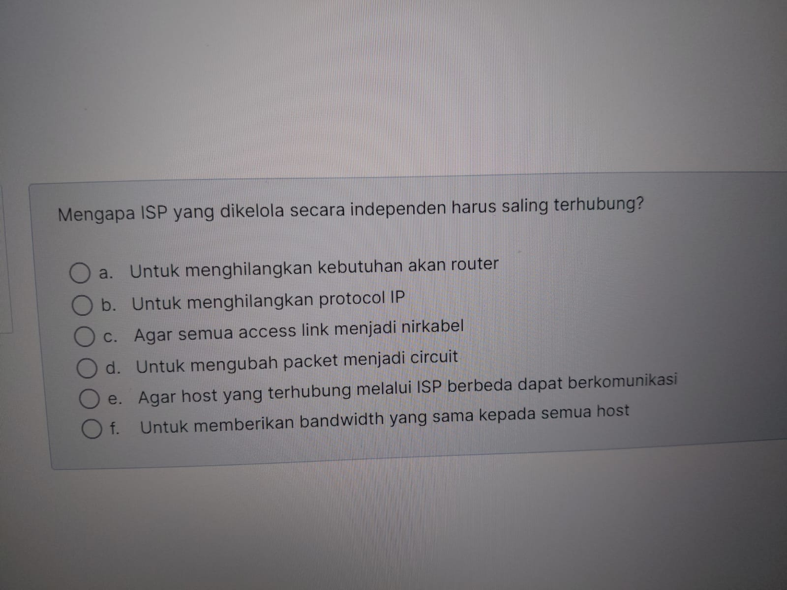

Mengapa ISP yang dikelola secara independen harus saling terhubung?

<strong>Jawaban dan penjelasan</strong>

**Jawaban: e.** Interkoneksi membuat host yang tersambung melalui ISP berbeda dapat saling berkomunikasi. Internet pada dasarnya adalah *network of networks*.

## 29. Data center untuk client-server skala besar

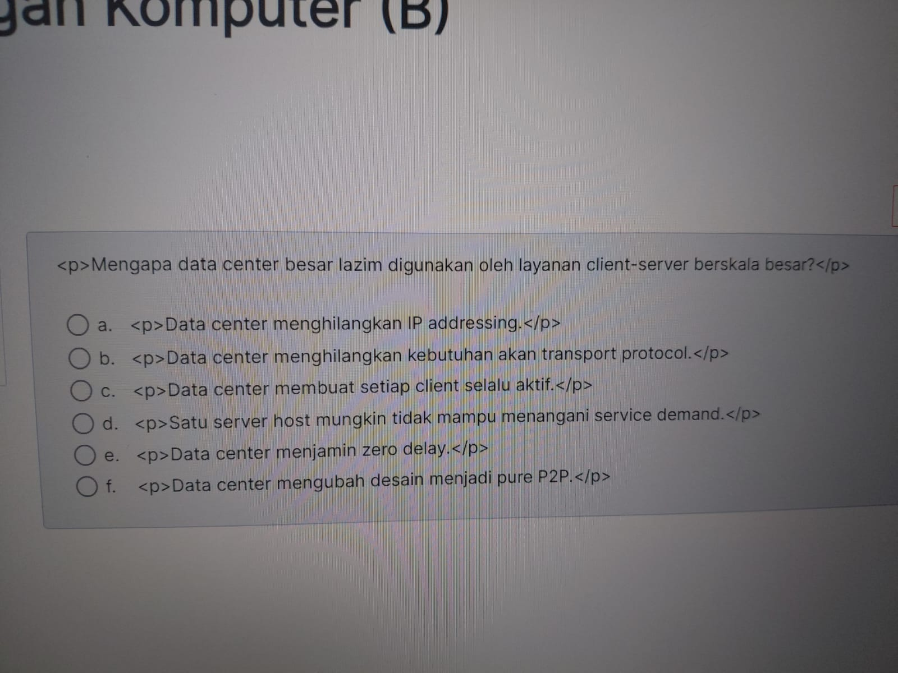

Mengapa layanan client-server berskala besar lazim menggunakan data center besar?

<strong>Jawaban dan penjelasan</strong>

**Jawaban: d.** Satu server mungkin tidak mampu menangani volume permintaan yang besar. Sekumpulan server di data center memungkinkan pembagian beban, skalabilitas, redundansi, dan ketersediaan yang lebih baik.

## 30. Layer yang diproses router

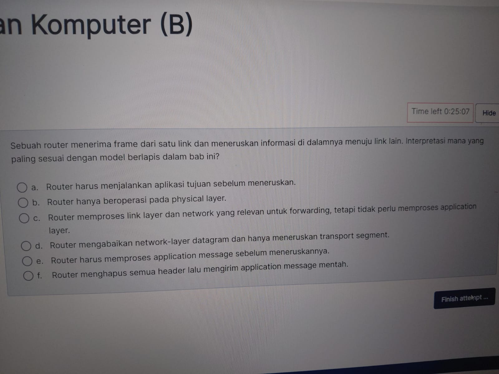

Router menerima frame dari satu link dan meneruskan informasinya ke link lain. Interpretasi mana yang sesuai dengan model berlapis?

<strong>Jawaban dan penjelasan</strong>

**Jawaban: c.** Router memproses link layer untuk menerima dan membentuk frame pada tiap link, serta network layer untuk menentukan forwarding datagram. Router biasa tidak perlu menjalankan application layer milik paket yang diteruskan.

## Rekap kunci jawaban

| No. | Kunci | Topik singkat |
|---:|:---:|---|
| 1 | e | Header transport |
| 2 | d | Instantaneous vs average throughput |
| 3 | c | Kebutuhan telepon Internet |
| 4 | e | Urutan PDU |
| 5 | d | Layer pada perangkat |
| 6 | f | P2P berbasis chunk |
| 7 | a | Arsitektur P2P |
| 8 | d | Definisi protokol |
| 9 | a | Kompatibilitas protokol |
| 10 | b | PDU antarlayer |
| 11 | c | Queueing delay |
| 12 | a | Circuit switching |
| 13 | a | Pertumbuhan Web |
| 14 | b | Transmission vs propagation |
| 15 | d | Propagasi radio |
| 16 | e | Shared cable access |
| 17 | b | FTP out-of-band A |
| 18 | c | FTP out-of-band B |
| 19 | c | Throughput |
| 20 | d | FTP LIST A |
| 21 | b | Segment ke datagram |
| 22 | a | Traceroute |
| 23 | d | Virus vs worm |
| 24 | e | FTP LIST B |
| 25 | d | Elastic application A |
| 26 | d | Link-layer switch |
| 27 | f | Elastic application B |
| 28 | e | Interkoneksi ISP |
| 29 | d | Data center |
| 30 | c | Forwarding oleh router |
